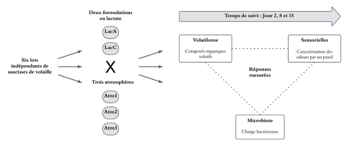
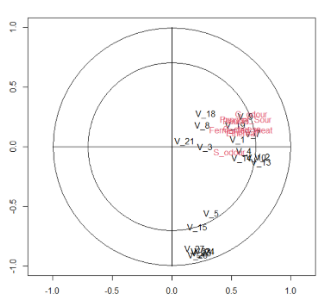
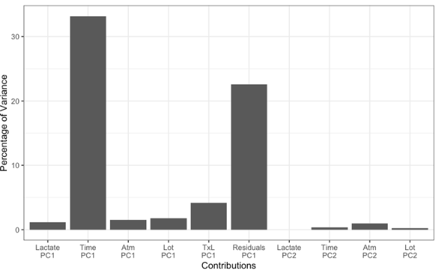
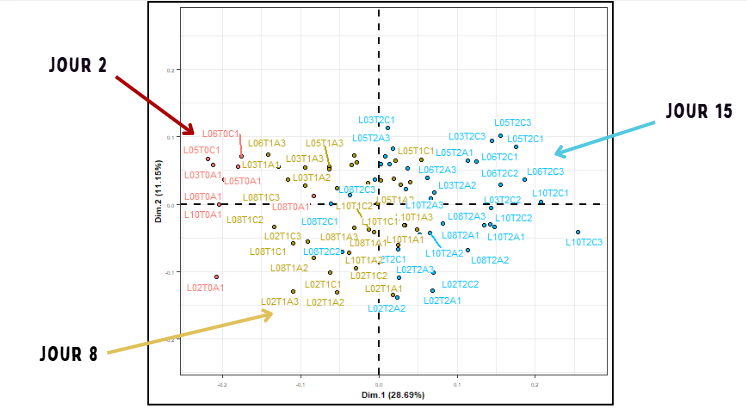

# 🥩 Analyse de l'Altération de la Viande : Approche Omique

## 📌 Présentation du Projet
Ce projet de biostatistique étudie les mécanismes d'altération de saucisses de volaille. L'objectif est de comprendre comment la conservation influence la qualité du produit en croisant trois types de mesures :

1. **Le Microbiote** : Abondance de 95 clusters bactériens (regroupés par phylums : Firmicutes, Proteobacteria, etc.)
2. **Le Volatilome** : Analyse de 20 molécules chimiques odorantes.
3. **Le Sensoriel** : Évaluation par des experts de 12 types d'odeurs (acide, rance, soufrée, etc.).

---

## 📊 Résultats les plus pertinents

### 1. Pourquoi la viande sent-elle mauvais ? (Analyse PLS2)
Nous avons cherché à savoir si les molécules chimiques expliquent les odeurs perçues.
* **Résultat :** Le **méthanethiol** et le **diméthyl sulfide** sont les principaux marqueurs des odeurs de décomposition (soufrée/pourri).
* **Application :** Identification de biomarqueurs pour prédire la fraîcheur sans test sensoriel humain.

### 2. L'impact du temps de conservation (Analyse ASCA+)
L'analyse statistique permet de classer l'influence des facteurs (Temps, Atmosphère, Lactate).
* **Résultat :** Le **temps** est le facteur dominant (n°1). On observe une rupture nette des profils entre le début (J2) et la fin de conservation (J15).

### 3. Quelle donnée est la plus fiable ? (Analyse Multibloc)
En combinant les trois jeux de données, nous avons identifié quelle dimension est la plus représentative de l'état réel de la viande.
* **Résultat :** C'est le bloc **Sensoriel** qui porte l'information la plus discriminante pour séparer les produits frais des produits altérés.

---

## 💡 Ce qu'il faut retenir (Conclusions)

* **Le temps est le facteur n°1 :** Plus le temps passe, plus les bactéries se développent, ce qui entraîne une hausse inévitable des odeurs désagréables.
* **Le lien "Odeur - Molécule" est prouvé :** Les molécules comme le méthanethiol sont les preuves chimiques directes de l'odeur de "viande gâtée".
* **Le mode de conservation change la chimie :** L'emballage (sous vide ou lactate) modifie la signature des molécules produites, changeant ainsi la perception du vieillissement.
* **Les bactéries dépendent de la fabrication :** Le type de bactéries présentes dépend davantage du **lot de fabrication** initial que de la durée de conservation elle-même.

---

## 🚀 Stack Technique
* **Langage :** R
* **Analyses :** PLS2, ASCA+, MBPCA (Analyse Multibloc), MFA.
* **Packages :** `limpca`, `FactoMineR`.

---
*Projet réalisé par : Ofelia Diabo, Andréa Kouadio & Nyna Edelin*
---

## 💡 Ce qu'il faut retenir (Conclusions)

* **Le temps est le facteur n°1 :** Plus le temps passe, plus les bactéries se développent et plus les odeurs désagréables augmentent.
* **Le lien "Odeur - Molécule" est prouvé :** Des molécules comme le méthanethiol sont les preuves chimiques de l'odeur de "viande gâtée".
* **Le mode de conservation change la chimie :** L'emballage modifie la "signature" des odeurs, mais ne stoppe pas l'évolution biologique.
* **Les bactéries dépendent de la fabrication :** Le type de bactéries présentes dépend surtout du **lot de fabrication** initial plutôt que de la durée de conservation.

---

## 🚀 Stack Technique
* **Langage :** R
* **Analyses :** PLS2, ASCA+, MBPCA (Analyse Multibloc), MFA.
* **Packages :** `limpca`, `FactoMineR`.

---
*Projet réalisé par : Ofelia Diabo, Andréa Kouadio & Nyna Edelin*
---

## Ce qu'il faut retenir (Conclusions)

Pour rendre les résultats simples à comprendre, voici ce que l'étude a démontré :

* **Le temps est le facteur n°1 :** Plus le temps passe, plus les bactéries se développent et plus les odeurs désagréables augmentent. C'est le changement le plus visible.
* **Le lien "Odeur - Molécule" est prouvé :** Nous avons identifié que certaines molécules précises (comme le méthanethiol) sont directement responsables de l'odeur de "viande gâtée". Si on détecte ces molécules, on sait que la viande n'est plus bonne.
* **Le mode de conservation change la chimie :** Selon que la viande est conservée sous vide ou avec du lactate, les molécules produites ne sont pas les mêmes. Cela change la manière dont le produit "vieillit".
* **Les bactéries dépendent de la fabrication :** Contrairement aux odeurs, le type de bactéries présentes dépend surtout du "lot" (la série de fabrication en usine) plutôt que du temps qui passe.

---

## 🚀 Outils Utilisés

* **Langage :** R
* **Logiciels :** Packages `limpca` et `FactoMineR` pour les calculs.
